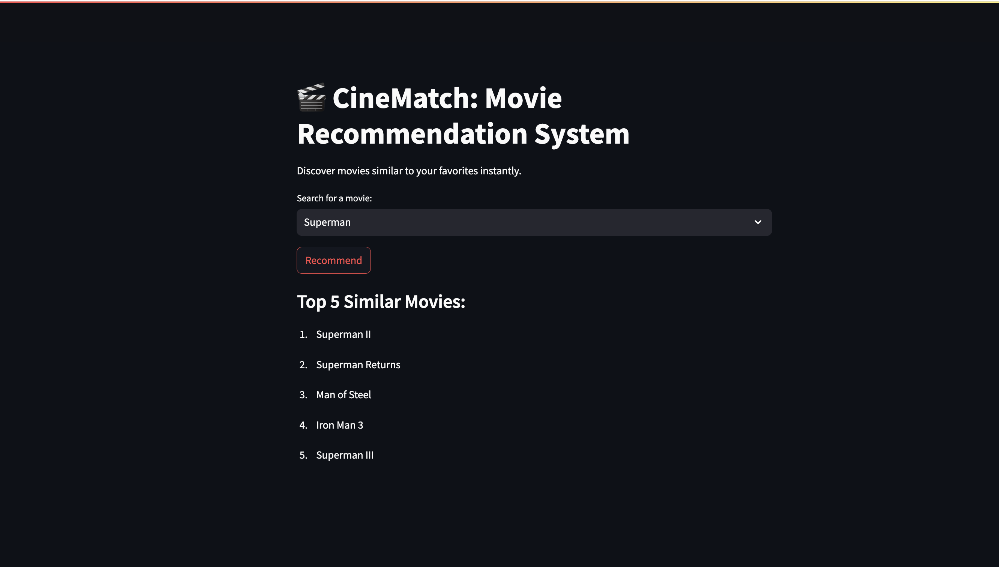
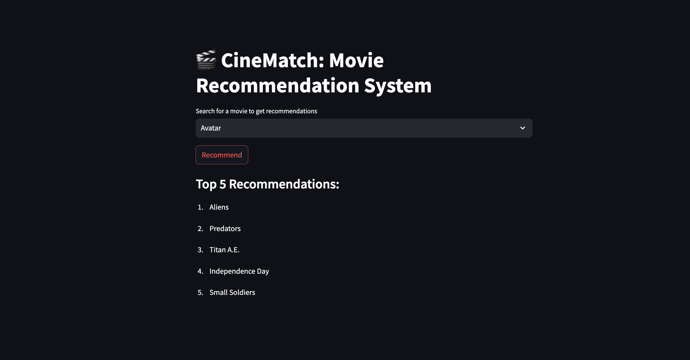

# CineMatch 🎬

A content-based movie recommendation system built with Streamlit, using TF-IDF, cosine similarity, and a clean interface for easy exploration of similar movies.

- 📸 Demo

---

## About 

CineMatch uses a Content-Based Recommendation System, which suggests movies by analyzing their descriptive features such as genres, keywords, overviews, and tags.

By converting these textual features into numerical vectors using vectorization techniques and computing cosine similarity, the system identifies and recommends movies that are most similar to the one the user selects.

This approach ensures that recommendations are relevant, explainable, and personalized based on the content of the movies themselves, without requiring user watch history or ratings data.

---

## 🛠️ Tech Stack

* Python, Pandas, NumPy

* NLTK for preprocessing

* scikit-learn for vectorization and similarity

* Streamlit for the frontend

---

## 🚀 Features

* ✅ Instant Movie Recommendations: Enter any movie title to receive the Top 5 most similar movies based on content features.

* ✅ Clean, Interactive UI: Simple, user-friendly interface for exploring your movie dataset effortlessly.

* ✅ Fast & Lightweight: Optimized backend for quick, responsive recommendations.